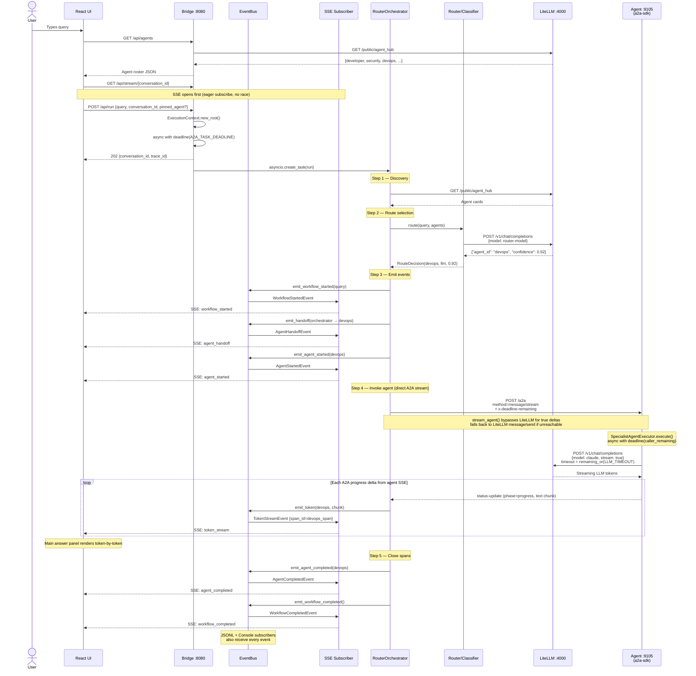
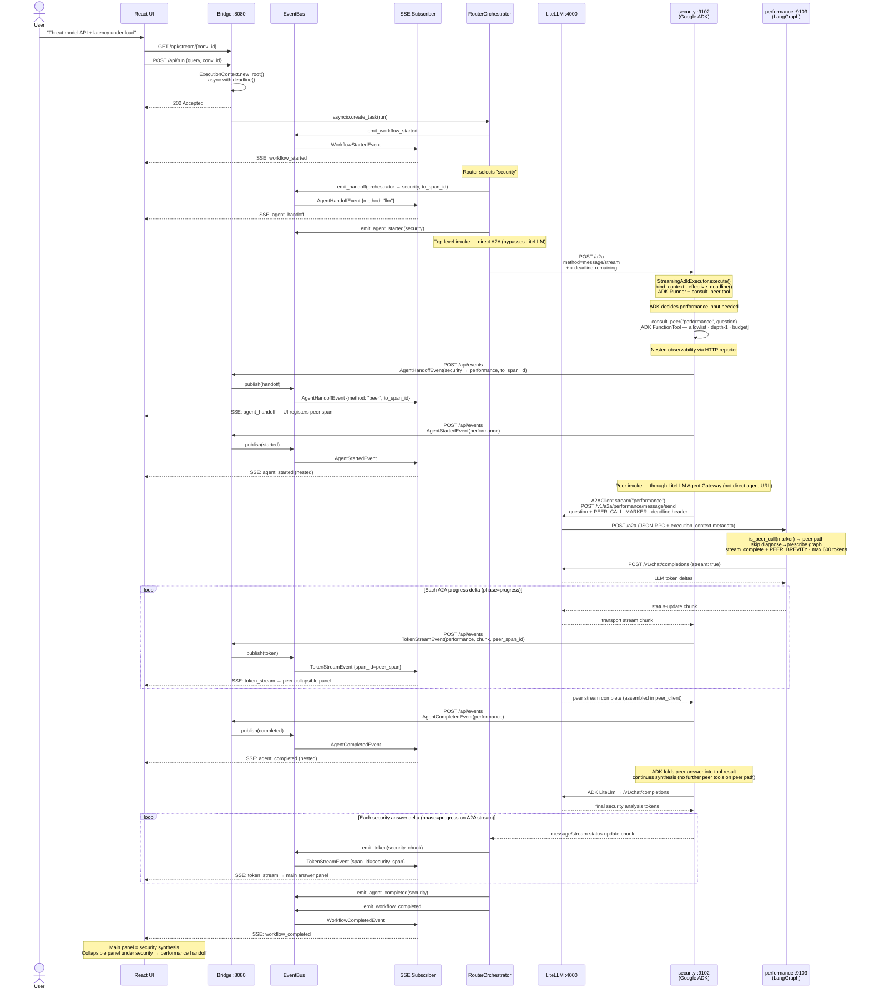
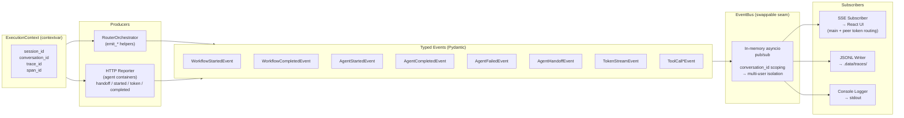

# Multi-Agent A2A — cross-framework interop via the A2A protocol

Six specialist agents **registered with a LiteLLM proxy** so that
LiteLLM is both:

- the **LLM gateway** every agent calls through, and
- the **LiteLLM Agent Gateway** (A2A agent registry / hub) the UI discovers from
  ([LiteLLM A2A docs](https://docs.litellm.ai/docs/a2a),
   [AI Hub docs](https://docs.litellm.ai/docs/proxy/ai_hub),
   available since LiteLLM v1.80.0).

**Cross-framework interoperability — three frameworks, one protocol:**
- the **`performance` agent is a [LangGraph](https://github.com/langchain-ai/langgraph) state machine** (`StateGraph`: `diagnose → prescribe`, driven by a custom `AgentExecutor`),
- the **`security` agent runs on [Google ADK](https://github.com/google/adk-python)** (`LlmAgent` + `Runner` + `A2aAgentExecutor`),
- the remaining **four agents use the `a2a-sdk` executor directly** (`SpecialistAgentExecutor`).

All three expose identical A2A endpoints — proving the protocol is truly
framework-agnostic. The rest of the system (LiteLLM hub, peer
consultation, React UI, registration) sees no difference.

…and the agents are **peers**: when a question crosses domains, an agent
can consult another agent via A2A mid-task using the OpenAI tool-call
shape (model="a2a/<peer>") through the same LiteLLM gateway. Ask the
developer for a JWT auth design and it phones security (the ADK agent)
for the threat input before answering — crossing the framework boundary
transparently.

### End-state topology

At a glance — three agent frameworks, one LiteLLM hub, one React console:

```
                         ┌──────────────────────────────┐
                         │   React UI + Bridge  :8080   │
                         │  SSE · Auto-Route · Pin agent│
                         └──────────────┬───────────────┘
                                        │
                         ┌──────────────▼───────────────┐
                         │      LiteLLM Hub  :4000       │
                         │  registry · a2a/<name> · LLM  │
                         └──┬────┬────┬────┬────┬────┬──┘
                            │    │    │    │    │    │
          ┌─────────────────┘    │    │    │    └─────────────────┐
          │                      │    │    │                      │
    ┌─────▼──────┐  ┌───────────▼┐  ┌▼──────────┐  ┌───────────▼──────────┐
    │ Developer   │  │  Testing   │  │  DevOps    │  │   Code Reviewer      │
    │ (a2a-sdk)   │  │ (a2a-sdk)  │  │ (a2a-sdk)  │  │     (a2a-sdk)        │
    │ Claude Opus │  │ Claude Opus│  │ Claude Opus│  │     Claude Opus      │
    └──────┬──────┘  └────────────┘  └─────┬──────┘  └──────────────────────┘
           │                               │
           │ consult_peer("security")      │ consult_peer("performance")
           │         A2A via LiteLLM       │         A2A via LiteLLM
           ▼                               ▼
    ┌──────────────┐                ┌──────────────┐
    │  Security     │◀── A2A ─────▶│ Performance   │
    │ (Google ADK)  │    protocol  │  (LangGraph)  │
    │ Claude Opus   │              │  Claude Opus  │
    └──────────────┘                └──────────────┘
      Framework 2                     Framework 3
```

| Layer | Role |
|-------|------|
| **React UI + Bridge** | Orchestrates runs, streams typed events (token-by-token), ingests nested peer spans via `POST /api/events` |
| **LiteLLM Hub** | Single front door — agent registry, `a2a/<name>` routing for peer calls, Claude Opus for every agent's LLM |
| **Four a2a-sdk agents** | Developer, Testing, DevOps, Code Reviewer — `SpecialistAgentExecutor` + optional `consult_peer` tool loop |
| **Security (Google ADK)** | `LlmAgent` + streaming ADK executor — same A2A wire surface, different internal engine |
| **Performance (LangGraph)** | `StateGraph` (`diagnose → prescribe`) — same A2A wire surface, different internal engine |

Peer calls are opaque to the caller: once `consult_peer()` runs, it uses native A2A JSON-RPC via the **LiteLLM Agent Gateway** (`POST /v1/a2a/{peer}/message/send`) — not framework-specific client code. The orchestrator's top-level invoke is the exception: it uses direct `stream_agent()` to the agent URL.

---

## Overall Architecture

```mermaid
graph TB
    subgraph UI["Frontend (React + Vite + Tailwind)"]
        Browser["Browser SPA"]
        SSEHook["useAgentStream<br/>eager SSE → POST /api/run"]
        TokenRouter["Token router<br/>span_id → main answer<br/>or peer collapsible"]
        AgentStrip["AgentStrip<br/>Auto-Route / Pin agent"]
    end

    subgraph Bridge["Bridge Process :8080"]
        API["Starlette API Server"]
        Orch["RouterOrchestrator"]
        Classifier["Router / Classifier<br/>(LLM → keyword → default)"]
        Bus["EventBus<br/>(async in-memory pub/sub)"]
        SSESub["SSE Subscriber<br/>conversation-scoped"]
        JSONLSub["JSONL Trace Writer"]
        ConsoleSub["Console Subscriber"]
        EventIngest["POST /api/events<br/>(nested lifecycle + tokens)"]
        RootDeadline["async with deadline()<br/>root wall-clock budget"]
    end

    subgraph Observability["Observability Pipeline"]
        ExecCtx["ExecutionContext<br/>(session → trace → span)"]
        Events["Typed Event Model<br/>workflow / handoff / token_stream / …"]
        Emitters["emit_* helpers<br/>(orchestrator, in-process)"]
        Reporter["HTTP Reporter<br/>(agent containers → bridge)"]
    end

    subgraph LiteLLM["LiteLLM Hub :4000 (separate Docker stack)"]
        Gateway["LiteLLM Agent Gateway<br/>/v1/a2a/{agent}/message/send"]
        LLMProxy["LLM Proxy<br/>/v1/chat/completions"]
        Registry["Agent Registry<br/>/v1/agents + /public/agent_hub"]
        DB["Postgres"]
    end

    subgraph Agents["Agent Containers"]
        subgraph SDK["a2a-sdk Agents"]
            Dev["developer :9101<br/>SpecialistAgentExecutor"]
            Test["testing :9104<br/>SpecialistAgentExecutor"]
            DevOps["devops :9105<br/>SpecialistAgentExecutor"]
            CR["code_reviewer :9106<br/>SpecialistAgentExecutor"]
        end
        subgraph ADK["Google ADK"]
            Sec["security :9102<br/>LlmAgent + PeerAwareAdkExecutor"]
        end
        subgraph LG["LangGraph"]
            Perf["performance :9103<br/>StateGraph: diagnose → prescribe"]
        end
    end

    subgraph Resilience["Resilience Layer"]
        Retry["Exponential Backoff<br/>+ Full Jitter"]
        CB["Per-target<br/>Circuit Breaker"]
        Deadline["Wall-clock Deadline<br/>contextvar + x-deadline-remaining"]
    end

    %% UI → Bridge
    Browser --> AgentStrip
    Browser --> SSEHook
    SSEHook -->|"GET /api/stream/{conv_id}"| SSESub
    SSEHook -->|"POST /api/run<br/>{pinned_agent?}"| API
    Browser -->|"GET /api/agents"| API

    %% Bridge orchestration
    API --> RootDeadline
    RootDeadline --> Orch
    Orch --> Classifier
    Classifier -->|"LLM routing call"| LLMProxy
    Orch -->|"emit_* at every step"| Emitters
    Emitters --> Bus

    %% Bus fan-out
    Bus --> SSESub
    Bus --> JSONLSub
    Bus --> ConsoleSub
    SSESub -->|"SSE frames<br/>conversation-scoped"| TokenRouter
    TokenRouter --> Browser

    %% Routed agent — direct native A2A stream (true token deltas)
    Orch -->|"A2AClient.stream_agent()<br/>POST {agent_url}/a2a<br/>method=message/stream"| Dev
    Orch -->|"stream_agent()"| Sec
    Orch -->|"stream_agent()"| Perf
    Orch -->|"stream_agent()"| Test
    Orch -->|"stream_agent()"| DevOps
    Orch -->|"stream_agent()"| CR
    Orch -.->|"fallback only:<br/>LiteLLM message/send"| Gateway

    %% Each orchestrator chunk → bus → UI main answer panel
    Orch -->|"emit_token(routed agent span)"| Emitters

    %% Agent → LLM (inside container)
    Dev -->|"stream_complete() → LiteLLM"| LLMProxy
    Sec -->|"ADK LiteLlm → LiteLLM"| LLMProxy
    Perf -->|"LangGraph nodes → LiteLLM"| LLMProxy
    Test -->|"stream_complete() → LiteLLM"| LLMProxy
    DevOps -->|"stream_complete() → LiteLLM"| LLMProxy
    CR -->|"stream_complete() → LiteLLM"| LLMProxy

    %% Peer consultation — A2A stream through LiteLLM Agent Gateway
    Dev -.->|"consult_peer() → A2AClient.stream()<br/>message/send + transport stream"| Gateway
    Sec -.->|"consult_peer() → stream()"| Gateway
    Gateway -.->|"proxies A2A"| Sec
    Gateway -.->|"proxies A2A"| Perf

    %% Nested events + peer tokens (cross-process)
    Dev -.->|"report_handoff / started / token / completed"| EventIngest
    Sec -.->|"report_handoff / started / token / completed"| EventIngest
    EventIngest -->|"parse_event → publish"| Bus

    %% Observability + deadline propagation
    ExecCtx -->|"contextvar (in-process)"| Emitters
    ExecCtx -->|"HTTP headers + metadata"| Reporter
    Events --> Emitters
    Events --> Reporter
    Reporter --> EventIngest
    Deadline -.->|"x-deadline-remaining header<br/>deadline_remaining metadata"| Gateway
    Deadline -.->|"effective_deadline()<br/>remaining_or() at every hop"| Dev
    Deadline -.->|"effective_deadline()"| Sec

    %% Resilience wraps outbound calls
    Retry -.-> Dev
    CB -.-> Dev
    Deadline -.-> Orch

    %% Registry
    Registry --> DB
    Orch -->|"discovery"| Registry

    style UI fill:#fce7f3,stroke:#db2777
    style Bridge fill:#f0fdf4,stroke:#16a34a
    style LiteLLM fill:#fef3c7,stroke:#d97706
    style Agents fill:#fce7f3,stroke:#db2777
    style Observability fill:#f5f3ff,stroke:#7c3aed
    style Resilience fill:#fff7ed,stroke:#ea580c
```



### How to read the diagram

| Color | Layer | Purpose |
|-------|-------|---------|
| Pink | **Frontend** | React SPA — Auto-Route / Pin agent, eager SSE, token-by-token rendering |
| Green | **Bridge** | API server, orchestrator, event bus, SSE/JSONL/console subscribers, nested event ingest |
| Yellow | **LiteLLM Hub** | LiteLLM Agent Gateway (peer calls), LLM proxy, agent registry (separate Docker stack) |
| Pink | **Agents** | Six specialists across three frameworks |
| Purple | **Observability** | Typed events, execution context, in-process emitters, HTTP reporter |
| Orange | **Resilience** | Retry, circuit breaker, wall-clock deadline — wraps every outbound call |

**Solid arrows** = runtime data flow. **Dashed arrows** = peer consultation, nested HTTP reporting, deadline propagation, and LiteLLM fallback paths.

### Streaming model (three paths)

| Path | Who | Transport | Events on bus | UI destination |
|------|-----|-----------|---------------|----------------|
| **Routed agent** | `RouterOrchestrator` | `A2AClient.stream_agent()` → agent's native `POST /a2a` with `message/stream` (bypasses LiteLLM for true deltas). Falls back to LiteLLM `message/send` if direct stream is unreachable. | `emit_token()` on orchestrator span | Main answer panel — tokens append incrementally |
| **Peer consult** | `consult_peer()` inside agent container | `A2AClient.stream()` → **LiteLLM Agent Gateway** `/v1/a2a/{peer}/message/send` with transport-level `httpx.stream` | `report_handoff`, `report_agent_started`, **`report_token`** (per chunk), `report_agent_completed` via `POST /api/events` | Collapsible peer panel under the matching handoff line (`to_span_id` correlation) |
| **Agent LLM** | Inside any agent executor | `stream_complete()` / ADK / LangGraph → LiteLLM `/v1/chat/completions` | Not on bus directly — folded into A2A stream above | Visible only after the agent emits A2A progress/status updates |

Nothing bypasses the bus for UI-visible events: orchestrator emits in-process; agents POST nested lifecycle + token events to the bridge, which republishes onto the same bus the SSE subscriber reads.

### Deadline propagation

One shrinking wall-clock budget flows from the bridge through every hop:

1. **Root** — `POST /api/run` wraps orchestration in `async with deadline()` (`A2A_TASK_DEADLINE`, default 180s).
2. **Outbound A2A** — `A2AClient` stamps `x-deadline-remaining` (HTTP header) and `deadline_remaining` (JSON-RPC metadata) on every call.
3. **Callee agents** — each executor reads the caller's remaining budget via `effective_deadline()` and installs `async with deadline(min(own_default, caller_remaining))`.
4. **Every I/O layer** — LLM calls, registry fetches, peer consults, and stream opens use `remaining_or(default)` / `check_deadline()` so no single hop can outlive the parent budget.

If the timer fires anywhere, the task fails cleanly (`DeadlineExceeded` → `agent_failed` + `workflow_completed`) instead of hanging.

### UI streaming contract

1. UI opens `GET /api/stream/{conversation_id}` **before** `POST /api/run` (no startup race).
2. Every bus event arrives as an SSE frame with full correlation (`conversation_id`, `trace_id`, `span_id`, `parent_span_id`).
3. **`token_stream`** routing in the React app:
   - `span_id` matches a peer handoff's `to_span_id` → accumulate in `peerTokens[spanId]` → render collapsibly under that consult line.
   - Otherwise → append to the main streamed answer.
4. **Auto-Route vs Pin agent** — `pinned_agent` on `/api/run` skips LLM classification and routes directly to the chosen specialist.

---

## Setup

```bash
cd multi-agent-a2a

# 1. Configure
cp .env.example .env
# edit .env — set litellm_api_key (must match LITELLM_MASTER_KEY in litellm-stack/.env)
# AGENT_HOST / AGENT_PUBLIC_HOST are already correct for Docker.

# 2. Start the LiteLLM hub first — its own stack (see litellm-stack/README.md):

cd litellm-stack && cp .env.example .env && docker compose up -d
curl -sf http://localhost:4000/health/readiness && echo OK

# 3. Build + run everything in containers --> All agents,bridge, UI
docker compose up -d --build
```

That's it. One multi-stage image (Node builds the React UI, Python installs
deps) runs all six agents plus the **bridge** — which serves the API and the
built UI on one port and owns the event bus + orchestration.

The **`register`** service runs automatically as part of `docker compose up` —
it waits for every agent to be healthy, upserts each Agent Card into the LiteLLM
registry (idempotent: `POST /v1/agents`, `409 → PUT`), then exits. Re-register
on demand any time (e.g. after changing an agent's card or URL):

```bash
docker compose run --rm register
# …or explicitly:
docker compose run --rm bridge python -m scripts.register_with_litellm
```

Open the app at **<http://localhost:8080>**.

### Day-to-day commands

```bash
docker compose ps                       # see status + health
docker compose logs -f developer        # tail one agent's logs
docker compose logs -f                  # tail everything
docker compose restart performance      # bounce one agent
docker compose run --rm register        # re-register agents on demand
docker compose down                     # stop + remove (DB and LiteLLM untouched)
docker compose up -d --build            # rebuild after code changes
docker compose up -d --no-deps --force-recreate developer   # recreate one service
```

### Manual registration / fixing a stale URL

If an agent was registered with the wrong URL (e.g. `127.0.0.1` before
you switched to `host.docker.internal`), `POST /v1/agents` will refuse
to re-register it ("already exists"). Delete the stale entry by UUID:

```bash
# 1. find the UUID
curl -s http://localhost:4000/v1/agents \
     -H "Authorization: Bearer <master_key>" \
     | python3 -c "import sys,json; [print(a['agent_id'], a['agent_name'], a['agent_card_params'].get('url')) for a in json.load(sys.stdin)]"

# 2. delete it
curl -X DELETE http://localhost:4000/v1/agents/<uuid> \
     -H "Authorization: Bearer <master_key>"

# 3. re-register
docker compose run --rm register
```

Or just use the LiteLLM admin UI (Agents tab) to edit/delete entries.

---

## Sequence Diagram 1: Basic Flow (no peer consultation)

A user asks *"Set up a canary deploy on EKS with automatic rollback"* — routed to the `devops` agent.



---

## Sequence Diagram 2: Flow with Peer Consultation

A user asks *"Threat-model this API and assess latency risks under load"* — routed to **`security`** (Google ADK), which consults **`performance`** (LangGraph) mid-task.

> **Allowlist note:** Default config has `security.peers = ["developer"]` only. This diagram shows the **cross-framework ADK → LangGraph** path; enable it by adding `"performance"` to `security.peers` in [`common/decorations.py`](common/decorations.py).



---

## Topology: two independent Compose stacks

The agents, the registration sidecar, and the bridge (which serves the React UI) run as
**containers managed by [`docker-compose.yml`](docker-compose.yml)** in
this repo. LiteLLM runs in **its own separate Compose stack** (with a
Postgres for agent registry persistence), bundled in this repo under
[`litellm-stack/`](litellm-stack/README.md). The two stacks are deliberately
independent so you can recycle the agents without wiping the registry.

```
┌──────────────────────────────────────┐   ┌──────────────────────────────┐
│  multi-agent-a2a/  (this repo)       │   │  litellm/  (separate stack)  │
│  docker-compose.yml                  │   │  docker-compose.yml          │
│                                      │   │                              │
│    maa-developer       :9101         │   │    litellm        :4000      │
│    maa-security        :9102 (ADK)   │   │    litellm_db     :5432      │
│    maa-performance     :9103 (LG)    │   │                              │
│    maa-testing         :9104         │   │                              │
│    maa-devops          :9105         │   │                              │
│    maa-code-reviewer   :9106         │   │                              │
│    maa-register   (one-shot)         │   │                              │
│    maa-bridge          :8080 (API+UI)│   │                              │
└────────────────┬─────────────────────┘   └──────────────┬───────────────┘
                 │                                        │
                 └───── host.docker.internal ─────────────┘
                 (bidirectional; works on Mac, Windows,
                  and Linux via `extra_hosts: host-gateway`)
```

Why two stacks rather than one:

- LiteLLM persists registered agents in Postgres — recycling the agent
  containers must NOT wipe the registry.
- LiteLLM may already exist in your environment (shared across projects);
  you don't want this repo's compose-down to take it offline.
- The contract between them is just two URLs:
  agents reach LiteLLM at `host.docker.internal:4000`;
  LiteLLM reaches agents at `host.docker.internal:910x`.

See [`litellm-stack/README.md`](litellm-stack/README.md) for the
one-time LiteLLM setup (`cp .env.example .env` → `docker compose up -d`).

---

## Key choices

- **Each agent is a real A2A server** — three frameworks, one protocol:
  - **Four agents** use `a2a-sdk[http-server]` directly:
    `DefaultRequestHandler` + `InMemoryTaskStore` + a
    `SpecialistAgentExecutor` (translates A2A `RequestContext` → LLM
    call via LiteLLM → lifecycle events via `TaskUpdater`)
  - **Performance agent** uses **LangGraph** — a compiled `StateGraph`
    (`diagnose → prescribe`, sharing a typed `PerfState`) driven by a
    custom `LangGraphPerformanceExecutor` that turns each node update
    into an A2A `working` event. Nodes call the shared LiteLLM client.
    See [`agents/performance_langgraph_server.py`](agents/performance_langgraph_server.py).
  - **Security agent** uses **Google ADK** (`LlmAgent` + `LiteLlm`
    model + ADK `Runner` + `A2aAgentExecutor`). ADK handles the LLM
    reasoning; the A2A protocol surface (`DefaultRequestHandler`,
    `InMemoryTaskStore`, `A2AStarletteApplication`) is the same SDK
    underneath — proving ADK, LangGraph, and raw a2a-sdk agents are all
    wire-compatible
  - Agent cards are Pydantic `a2a.types.AgentCard` on all agents — wire
    compatible with any A2A client (including LiteLLM)
  - Convenience `POST /invoke` SSE endpoint kept for easy `curl` testing
- **LiteLLM is the only hub**:
  - `POST /v1/agents` registers each agent (via [`scripts/register_with_litellm.py`](scripts/register_with_litellm.py))
  - `GET /public/agent_hub` lists them for the UI
  - `POST /v1/chat/completions` with `model="a2a/<name>"` invokes them
- **Local "decorations"** for UI-only fields (icon, color, expertise list,
  per-agent model alias) live in [`common/decorations.py`](common/decorations.py)
  because the A2A `AgentCard` schema has no slot for them.

---

## Observability pipeline

Every observable action flows through a single pipeline: **typed events → event bus → subscribers**. Nothing bypasses the bus.



### Correlation model

Every event carries the full **correlation envelope** copied from the `ExecutionContext`:

| Field | Scope | Purpose |
|-------|-------|---------|
| `session_id` | User session | Groups multiple conversations |
| `conversation_id` | One conversation | Multi-user isolation — SSE subscriptions filter by this |
| `trace_id` | One end-to-end run | All events in a single query → answer flow |
| `span_id` | One unit of work | Distinguishes orchestrator span, agent span, peer span |
| `parent_span_id` | Parent span | Builds the span tree (orchestrator → agent → peer) |
| `tenant_id` / `user_id` | Identity | Multi-tenant isolation |

### Cross-process event capture

Agents run in separate containers and can't write to the bridge's in-memory bus directly. When an agent consults a peer, the **HTTP reporter** (`observability/reporter.py`) POSTs typed events to `POST /api/events` on the bridge:

```
Agent container                         Bridge container
─────────────────                       ────────────────
consult_peer("security", q)
  │
  ├─ report_handoff(ctx, dev→sec, to_span_id)  ──POST──►  /api/events → bus → SSE
  ├─ report_agent_started(sec)                   ──POST──►  /api/events → bus → SSE
  │
  ├─ A2AClient.stream(security, q)   ──► LiteLLM ──► security agent
  │     loop each chunk:
  │       report_token(peer_ctx, sec, chunk)     ──POST──►  /api/events → bus → SSE
  │                                                    UI routes by peer span_id
  │                                                    → collapsible peer panel
  │  ... security answers ...
  │
  ├─ report_agent_completed(sec)                 ──POST──►  /api/events → bus → SSE
  │
  └─ return assembled answer to tool loop
```

Using HTTP rather than a shared file or volume means this works across containers. Peer **tokens** are streamed the same way as lifecycle events: each chunk is a `TokenStreamEvent` stamped with the peer's `span_id`, correlated in the UI via the handoff's `to_span_id`.

---

## Peer-to-peer A2A (agents as clients)

Each agent has a configured `peers` list — the other agents it is allowed
to consult mid-task. When a question crosses domains, the executor offers
the LLM a single OpenAI-style tool, `consult_peer`, whose `peer_name`
enum is restricted to that list. If the model decides it needs help, it
emits a tool call; the executor invokes `consult_peer("security", "…")`,
which goes back through the **LiteLLM Agent Gateway** (`model="a2a/security"`),
gets the peer's answer, and feeds it back into the assistant turn. The
model can then issue more peer calls or finalize.

**Configured peers** (edit in [`common/decorations.py`](common/decorations.py)):

| agent          | can consult                              |
|----------------|------------------------------------------|
| developer      | security, performance, testing           |
| security       | developer                                |
| performance    | developer, devops                        |
| testing        | developer, security                      |
| devops         | security, performance                    |
| code_reviewer  | security, performance, testing           |

**Loop prevention — two independent bounds.**

- *Depth = 1.* When `consult_peer(...)` calls a peer, it embeds a marker
  (`<!-- a2a:peer-call depth=1 -->`) in the question. The peer's executor
  sees it via `is_peer_call(...)` and routes to the simple streaming path
  that does **not** expose the `consult_peer` tool. So peers can be
  consulted but cannot themselves consult — no `A→B→C` chains, no
  `A→B→A` loops.
- *Rounds ≤ `_MAX_TOOL_ITERS` (default 4).* This bounds how many
  sequential tool-loop rounds the top-level agent runs (a single round
  may fire several parallel `consult_peer` calls). If the model is still
  requesting tools when the cap is hit, the executor makes **one final
  call with `tool_choice="none"`** so the model is forced to synthesize
  an answer from the consultations already gathered — it never bails out
  with a placeholder. Worst case per request: `_MAX_TOOL_ITERS` auto
  rounds + 1 forced-synthesis round of LLM calls.

**Visibility.** Each peer call emits:
1. Structured typed events to the bridge via the HTTP reporter — **handoff** (with `to_span_id`), **started**, **token_stream** (per chunk), **completed/failed** — visible in the SSE stream, JSONL traces, console, and UI flow trail.
2. An A2A `working` status update with `metadata={"phase": "consulting_peer", "peer": "<name>"}` so the agent's log shows the consultation in progress.
3. In the React UI, peer tokens render **collapsibly under the matching handoff line** (correlated by `to_span_id` / peer `span_id`); the routed agent's own tokens render in the main answer panel.
4. A `**Consulted peers (A2A):**` markdown footer appended to the final answer, listing each consultation.

**Cost.** Each consultation is one extra LiteLLM round-trip: client →
LiteLLM (gateway) → peer agent → LiteLLM (peer's LLM call) → peer agent
→ LiteLLM → client. Worth it when the answer is materially better.

**Files:** [`common/peer_client.py`](common/peer_client.py) holds
`consult_peer`/`is_peer_call`/`strip_peer_marker`;
[`agents/base_server.py`](agents/base_server.py) holds the tool loop in
`SpecialistAgentExecutor._run_tool_loop()`.

---

## Cross-framework interop: three frameworks, one protocol

The six agents are built across
**three different agent frameworks**, and nothing downstream — not
LiteLLM, not the router, not the UI, not the other agents — can tell
which is which. The A2A protocol is the seam that makes the framework an
internal implementation detail.

| Agent | Framework | Internal engine | File |
|-------|-----------|-----------------|------|
| developer | **native a2a-sdk** | `SpecialistAgentExecutor` (tool-loop) | `agents/base_server.py` |
| testing | native a2a-sdk | `SpecialistAgentExecutor` | `agents/base_server.py` |
| devops | native a2a-sdk | `SpecialistAgentExecutor` | `agents/base_server.py` |
| code_reviewer | native a2a-sdk | `SpecialistAgentExecutor` | `agents/base_server.py` |
| **performance** | **LangGraph** | `StateGraph` (`diagnose → prescribe`) + `LangGraphPerformanceExecutor` | `agents/performance_langgraph_server.py` |
| **security** | **Google ADK** | `LlmAgent` + `Runner` + `A2aAgentExecutor` | `agents/security_adk_server.py` |

### The seam: what every agent shares

Regardless of framework, **every** agent is mounted with the exact same
four lines. This is the stitch — the one pattern that makes all three
frameworks line up on the wire:

```python
handler = DefaultRequestHandler(
    agent_executor=<EXECUTOR>,          # ← the ONLY thing that differs
    task_store=InMemoryTaskStore(),
)
app = A2AStarletteApplication(
    agent_card=spec.build_card(),       # same Pydantic AgentCard for all
    http_handler=handler,
).build(rpc_url="/a2a")                  # same JSON-RPC route for all
```

Swap `<EXECUTOR>` and you swap frameworks:

```python
SpecialistAgentExecutor(spec)            # native a2a-sdk  (tool-loop)
LangGraphPerformanceExecutor()           # LangGraph       (state machine)
A2aAgentExecutor(runner=runner)          # Google ADK      (ADK runner)
```

Everything else — the agent card, the `/a2a` JSON-RPC endpoint, the
`/.well-known/agent-card.json` discovery endpoint, the `/invoke`
convenience routes, the `/healthz` probe, and the LiteLLM registration
payload — is **identical across all six agents**.

### What differs *inside* each executor

| Layer | native a2a-sdk | LangGraph (performance) | Google ADK (security) |
|-------|----------------|-------------------------|------------------------|
| Reasoning shape | single tool-loop turn | `StateGraph`: `diagnose → prescribe` sharing a typed `PerfState` | ADK `LlmAgent` planned by an ADK `Runner` |
| A2A executor | `SpecialistAgentExecutor` (hand-built) | `LangGraphPerformanceExecutor` (drives `graph.astream`) | ADK's built-in `A2aAgentExecutor` |
| Lifecycle events | emitted by hand via `TaskUpdater` | one `working` event per graph node, then artifact | emitted by ADK's bridge |
| Session/state | stateless | LangGraph state object across nodes | ADK `Runner` + `InMemorySessionService` |
| LLM call | `stream_complete()` → `AsyncOpenAI` → LiteLLM | graph nodes call shared `complete()` → LiteLLM | ADK `LiteLlm(use_litellm_proxy=True)` → LiteLLM |

Note the last row: **all three route their LLM calls back through the same
LiteLLM proxy** to the same Claude model. One gateway, inbound (A2A
invocation) and outbound (LLM tokens), for every framework.

### What's identical on the wire (all six)

- `GET /.well-known/agent-card.json` — same Pydantic `AgentCard` shape
- `POST /a2a` — same A2A JSON-RPC (`message/send`, `message/stream`)
- `POST /invoke`, `/invoke-sync`, `GET /healthz` — same convenience surface
- Registration with LiteLLM `POST /v1/agents` — same payload
- Invocation via LiteLLM `model="a2a/<name>"` — same call, any framework

### Collaboration across the framework boundary

Peer consultation crosses frameworks transparently — **in both
directions**. Every framework can both *be consulted* and *consult*:

```
developer (a2a-sdk)  ──consult_peer("security")────► LiteLLM ──► security   (Google ADK)
developer (a2a-sdk)  ──consult_peer("performance")─► LiteLLM ──► performance (LangGraph)
security  (Google ADK) ─consult_peer("developer")──► LiteLLM ──► developer  (a2a-sdk)
```

The caller never knows the callee's framework. It calls `consult_peer(...)`;
LiteLLM routes the A2A JSON-RPC to the right endpoint; the answer comes
back. `a2a-sdk → ADK`, `a2a-sdk → LangGraph`, and `ADK → a2a-sdk` are the
same code path from the caller's side.

How each framework exposes the consult capability differs, but the wire
call is identical:

| Framework | How `consult_peer` is wired |
|-----------|-----------------------------|
| native a2a-sdk | an OpenAI tool in `SpecialistAgentExecutor._run_tool_loop` |
| Google ADK | an ADK `FunctionTool` on the `LlmAgent` (`tools=[consult_peer]`) |
| LangGraph | (performance is a leaf today; add a tool-node to enable) |

**Depth-1 holds across frameworks.** A consulted agent must never consult
further. The native and LangGraph paths enforce this by not exposing the
tool when they're invoked as a peer. The ADK runner is built once at
startup and can't drop its tool per-request, so `security_adk_server.py`
uses a `contextvars` flag (`_IN_PEER_CALL`) set by a thin
`PeerAwareAdkExecutor` wrapper: when the inbound request carries the
depth-1 marker, `consult_peer` refuses. Same guarantee, framework-
appropriate mechanism. *(Verified: when developer consults security,
security makes zero outbound consults.)*

### Switching a framework is one line

Each variant has its own launcher module, so swapping the framework an
agent runs on is a one-line change to the service's `command:` in
[`docker-compose.yml`](docker-compose.yml):

```yaml
# performance — pick one:
command: ["python", "-m", "agents.performance_langgraph_server"]  # LangGraph (current)
command: ["python", "-m", "agents.performance_server"]            # native a2a-sdk

# security — pick one:
command: ["python", "-m", "agents.security_adk_server"]           # Google ADK (current)
command: ["python", "-m", "agents.security_server"]               # native a2a-sdk
```

Then `docker compose up -d --no-deps --force-recreate <service>`. No
other file changes. The card, port, registration, routing, peer
consultation, and UI are all framework-agnostic.

---

## Repo layout

```
multi-agent-a2a/
├── common/
│   ├── log.py              — centralized logging setup (one format, one call per process)
│   ├── env_utils.py        — .env loader + URL helpers
│   ├── llm_client.py       — AsyncOpenAI client pointed at LiteLLM
│   ├── peer_client.py      — consult_peer() + nested event reporting
│   ├── decorations.py      — UI extras + peer allowlist per agent
│   ├── retry.py            — exponential backoff + circuit breaker
│   └── deadline.py         — per-request wall-clock budget
├── agents/
│   ├── specialists.py      — Pydantic AgentCard + system prompt per role
│   ├── base_server.py      — native a2a-sdk Starlette app + SpecialistAgentExecutor
│   ├── developer_server.py        — native a2a-sdk
│   ├── testing_server.py          — native a2a-sdk
│   ├── devops_server.py           — native a2a-sdk
│   ├── code_reviewer_server.py    — native a2a-sdk
│   ├── performance_langgraph_server.py — ★ LangGraph version (active)
│   ├── performance_server.py      — (legacy) native a2a-sdk, kept as reference
│   ├── security_adk_server.py     — ★ Google ADK version (active)
│   └── security_server.py         — (legacy) native a2a-sdk, kept as reference
├── router/
│   ├── classifier.py        — LLM routing + keyword fallback (used by orchestrator)
│   └── orchestrator.py      — RouterOrchestrator: discover → route → invoke → emit
├── observability/
│   ├── context.py           — ExecutionContext (session → trace → span) + contextvar
│   ├── events.py            — typed event model (Pydantic BaseEvent hierarchy)
│   ├── event_bus.py         — async in-process bus (swappable seam for Redis/NATS)
│   ├── emitters.py          — emit_* helpers (bridge-side)
│   ├── reporter.py          — HTTP reporter (agent-side → POST /api/events)
│   └── subscribers/
│       ├── sse.py           — SSE bridge (conversation-scoped queue → EventSource)
│       ├── jsonl.py         — append-only JSONL traces (.data/traces/{conv}/{trace}.jsonl)
│       └── console.py       — human-readable event logging
├── clients/
│   └── a2a_client.py        — structured A2A JSON-RPC client (stream + send, dual transport)
├── registry/
│   └── litellm_registry.py  — discover_cards() + register_agent() (409→PUT upsert)
├── models/
│   └── a2a.py               — AgentCardModel + orchestration envelopes
├── config/
│   └── settings.py          — Pydantic Settings (single typed config surface)
├── api/
│   └── server.py            — SSE bridge: /api/agents · /api/run · /api/stream · /api/events
│                              (also serves the built React UI)
├── frontend/                — React + Vite + Tailwind SPA (SSE consumer)
│   ├── src/App.jsx · hooks/useAgentStream.js · components/
│   └── package.json · vite.config.js
├── scripts/
│   └── register_with_litellm.py
├── litellm_config.yaml      — model aliases for the (external) Docker LiteLLM
├── requirements.txt
├── .env.example
├── Dockerfile               — multi-stage: Node UI build + Python + slim runtime
├── docker-compose.yml       — 6 agents + bridge (API + UI)
├── .dockerignore
├── .gitignore
└── README.md
```

---

## Try it from the console

Open <http://localhost:8080> and ask:

| Prompt                                                                   | Expected pick   |
|--------------------------------------------------------------------------|-----------------|
| Design a multi-tenant feature flag service.                              | `developer`     |
| Threat-model storing OAuth refresh tokens in Redis.                      | `security`      |
| Our checkout p99 jumped from 200ms to 1.8s — where do I start?           | `performance`   |
| Write a test plan for a Stripe webhook handler.                          | `testing`       |
| Set up a canary deploy on EKS with automatic rollback.                   | `devops`        |
| Review this snippet for bugs: `def add(a,b): return a-b`                 | `code_reviewer` |

Pin to a specific agent from the sidebar to bypass the router.

### Prompts that trigger peer-to-peer

The following prompts force visible peer consultation — you'll see the
"Consulted peers (A2A)" footer at the bottom of the answer.

| Prompt                                                                       | Primary agent  | Likely peers      |
|------------------------------------------------------------------------------|----------------|-------------------|
| Design a secure JWT auth service for a multi-tenant FastAPI app.             | developer      | security          |
| Review this snippet for bugs:<br>`def login(req): u = User.query...`<br>     | code_reviewer  | security, testing |
| Design a blue/green deploy for our checkout service.                         | devops         | security (auth at edge), performance (warm-up) |
| Why is our checkout p99 high right after a deploy?                           | performance    | devops            |
| Write a test plan for the password-reset endpoint.                           | testing        | security          |

---

## Smoke tests with curl

```bash
# 1. List agents from LiteLLM's hub
curl -s http://localhost:4000/public/agent_hub \
     -H "Authorization: Bearer <master_key>" | jq

# 2. Fetch an agent's card directly from the agent
curl -s http://127.0.0.1:8102/.well-known/agent-card.json | jq

# 3. Invoke via LiteLLM, OpenAI-compatible
curl -s http://localhost:4000/v1/chat/completions \
  -H "Authorization: Bearer <master_key>" \
  -H 'Content-Type: application/json' \
  -d '{
    "model": "a2a/security",
    "messages": [{"role":"user","content":"Threat-model a public REST API"}]
  }' | jq

# 4. Invoke via LiteLLM, native A2A JSON-RPC
curl -s http://localhost:4000/a2a/security/message/send \
  -H "Authorization: Bearer <master_key>" \
  -H 'Content-Type: application/json' \
  -d '{
    "jsonrpc": "2.0", "id": "req-1", "method": "message/send",
    "params": {
      "message": {
        "role": "user",
        "messageId": "m1",
        "parts": [{"kind":"text","text":"Threat-model a public REST API"}]
      }
    }
  }' | jq

# 5. Hit the agent directly, native A2A JSON-RPC (bypass LiteLLM)
curl -s http://127.0.0.1:8102/a2a \
  -H 'Content-Type: application/json' \
  -d '{
    "jsonrpc": "2.0", "id": 1, "method": "message/send",
    "params": {
      "message": {
        "role": "user",
        "messageId": "m1",
        "parts": [{"kind":"text","text":"Threat-model a public REST API"}]
      }
    }
  }' | jq

# 6. From inside the LiteLLM container (host.docker.internal sanity check)
docker exec litellm-litellm-1 python3 -c "import urllib.request; \
  print(urllib.request.urlopen('http://host.docker.internal:8101/healthz').read().decode())"

# 7. Hit the agent's non-A2A convenience SSE endpoint
curl -N -X POST http://127.0.0.1:8101/invoke \
  -H 'content-type: application/json' \
  -d '{"query":"Sketch the modules for a billing service"}'

# 8. Trigger a peer consultation — the response should contain a
#    "Consulted peers (A2A):" footer mentioning security.
curl -s http://localhost:4000/v1/chat/completions \
  -H "Authorization: Bearer <master_key>" \
  -H 'Content-Type: application/json' \
  -d '{
    "model": "a2a/developer",
    "messages": [{"role":"user","content":"Design a JWT-based auth service. Consult the security peer."}]
  }' | jq -r '.choices[0].message.content'

# 9. Watch events on the SSE stream (see peer handoffs live)
curl -N http://localhost:8080/api/stream/test-conv-id
```

---

## End-to-end flow of a single chat turn

1. User types in the React UI. Optionally pins an agent via **AgentStrip** (`pinned_agent` skips LLM routing).
2. UI opens an SSE connection to `GET /api/stream/{conversation_id}` on the bridge **before** calling run — eagerly subscribes to the bus (no startup race).
3. UI calls `POST /api/run` with the query, `conversation_id`, and optional `pinned_agent`. The bridge creates an `ExecutionContext.new_root()`, installs the root deadline via `async with deadline()`, fires orchestration as a background task, and returns `202`.
4. `RouterOrchestrator.run()` starts:
   - **Discovery**: fetches agent cards from the LiteLLM registry (`remaining_or()` on HTTP timeout).
   - **Selection**: asks `router.classifier.route(query, agents)` — or uses `pinned_agent` directly — tries LLM routing, falls back to keyword overlap, then default.
   - **Handoff**: emits `workflow_started` → `agent_handoff` (with `to_span_id`) → `agent_started` to the bus.
5. **Routed invocation**: `A2AClient.stream_agent()` opens a native `message/stream` session directly on the agent's `/a2a` URL (true token deltas from a2a-sdk progress events). Falls back to LiteLLM `message/send` if direct streaming is unreachable. Each answer delta → `emit_token()` → bus → SSE → main answer panel.
6. Inside the agent container, the framework-specific executor runs under `effective_deadline(caller_remaining)`:
   - If called as a peer (marker present) → simple streaming path, no tools.
   - If top-level with peers → tool loop with `consult_peer`. Each peer call:
     - Emits nested events to `POST /api/events` (handoff with `to_span_id`, started, **token per chunk**, completed/failed).
     - Streams the peer via `A2AClient.stream()` through LiteLLM (`message/send` + transport-level `httpx.stream`), propagating `x-deadline-remaining`.
     - Feeds the assembled peer answer back as a tool result.
   - Appends a `**Consulted peers (A2A):**` footer if any peers were used.
7. **UI token routing**: `token_stream` events whose `span_id` matches a peer handoff's `to_span_id` accumulate in collapsible peer panels; all other tokens append to the main streamed answer.
8. The orchestrator emits `agent_completed` and `workflow_completed` (or `agent_failed` on deadline/error). The JSONL subscriber persists the full trace to `.data/traces/{conversation_id}/{trace_id}.jsonl`.
9. The UI shows the full rendered answer, nested peer panels, and the flow trail of all events.

---

## Adding a new specialist

1. Add the agent's name + `AgentDecoration` to
   [`common/decorations.py`](common/decorations.py) (icon, color, role,
   expertise, model alias, and `peers` — the other agents it's allowed
   to consult).
2. Add a `SpecialistSpec` entry + a system prompt + skill list in
   [`agents/specialists.py`](agents/specialists.py).
3. Add a one-liner `<name>_server.py` next to the others.
4. Add a `<NAME>_PORT` env var to `.env`.
5. Copy one of the agent services in
   [`docker-compose.yml`](docker-compose.yml), change the name, port,
   `command:`, and the dependency line in `register.depends_on`.
6. If you used a new model alias, add it to `litellm_config.yaml` and
   restart the LiteLLM Docker stack.
7. `docker compose up -d --build` — the new agent comes up, the register
   sidecar re-runs, and the UI picks it up on the next refresh.

---

## Resilience: retries + per-target circuit breakers

Every call through [`common/llm_client.py`](common/llm_client.py)
(`chat`, `complete`, `stream_complete`) — and therefore every peer
consultation via [`common/peer_client.py`](common/peer_client.py) — is
wrapped with the resilience layer in [`common/retry.py`](common/retry.py).

**Retry policy** — exponential backoff with full jitter. Only *transient*
errors are retried (connection errors, timeouts, 429 rate limits, 5xx
server errors). Semantic failures (400 bad request, wrong model name,
auth errors) raise on the first attempt — no point burning tokens
retrying a permanently-broken call. The OpenAI SDK's own internal retry
loop is disabled (`max_retries=0`) so this is the single source of truth.

**Circuit breaker (per-target)** — one breaker per model alias
(`claude-opus-4-6`, `a2a/security`, …). After N consecutive failures
the breaker trips to **OPEN** and every subsequent call short-circuits in
~0 ms with `CircuitOpenError` instead of hammering a dead dependency.
After a cool-down it goes **HALF_OPEN** and allows one trial; success
closes it, failure re-opens it. So one flapping peer can't take the
whole mesh down with it.

**`stream_complete()`** retries on the initial stream-open call (the
common failure point). Once chunks start flowing, mid-stream errors
propagate — restarting a partially-consumed stream would silently
duplicate output.

**Peer consultation degrades gracefully.** If a peer is down (or its
breaker is OPEN), `consult_peer` returns a human-readable note
(`"consultation of \`security\` skipped — circuit breaker OPEN…"`)
instead of raising. The calling agent folds it into its own answer and
keeps going. (Deadline expiry is the one exception — that propagates so
the outer task can fail cleanly.)

**Per-request wall-clock deadline.** The bridge installs the root budget with `async with deadline()` on every `POST /api/run`. Every agent's `execute()` inherits a **shrunken** ceiling via cross-process propagation:

- **In-process**: a contextvar (`_DEADLINE_AT`) holds the absolute finish time; `remaining_or(default)` shrinks every HTTP timeout below.
- **Cross-process**: `A2AClient` sends `x-deadline-remaining` (header) and `deadline_remaining` (JSON-RPC metadata); callees call `effective_deadline()` → `min(own_default, caller_remaining)`.

Every layer below — `chat`, `stream_complete`, `with_retry`, `consult_peer`, registry fetches, stream opens, the ADK runner, the LangGraph graph — respects the shrinking budget. If the timer fires, inner work is cancelled and the executor emits a proper A2A `failed` event with `metadata.reason = "deadline_exceeded"` (or the bridge emits `agent_failed` for the orchestrator). `with_retry` also refuses to sleep past the deadline (no time-burning backoffs).

Without this, the worst case is approximately
`MAX_TOOL_ITERS × MAX_RETRIES × LLM_TIMEOUT × peers_consulted` —
multi-minute hangs are easy to produce with a single misbehaving peer.

**Tunables (env vars; defaults are sensible):**

```
A2A_TASK_DEADLINE      overall wall-clock budget per task    default 180.0
LLM_TIMEOUT            per-attempt HTTP timeout              default 60.0
LLM_MAX_RETRIES        total attempts incl. first            default 3
LLM_RETRY_BASE_DELAY   seconds for the first backoff         default 0.5
LLM_RETRY_MAX_DELAY    upper bound per backoff               default 8.0
LLM_RETRY_JITTER       "true"/"false"                        default true
LLM_BREAKER_THRESHOLD  consecutive failures to OPEN          default 5
LLM_BREAKER_RESET      seconds before HALF_OPEN trial        default 30.0
```

---

## Logging

All modules use a consistent structured logging convention via `common/log.py`:

**Format**: `HH:MM:SS [LEVEL] multi_agent.<component>: component.action key=value key=value`

Every log message follows the `component.action key=value` pattern — grep-friendly, machine-parseable, and consistent across all 17 modules. Entry-point processes call `setup()` once at startup. Logger names are namespaced under `multi_agent.*`.

Examples:
```
14:32:01 [INFO]  multi_agent.orchestrator: orchestration.discovery_failed trace_id=abc123
14:32:01 [INFO]  multi_agent.peer: peer.consult.start peer=security question_chars=120
14:32:02 [WARN]  multi_agent.retry: circuit.half_open name=a2a/security
14:32:03 [INFO]  multi_agent.agent: agent.startup agent=developer host=0.0.0.0 port=9101
14:32:04 [INFO]  multi_agent.register: register.ok agent=security url=http://... status=ok
```

---

## Gotchas

- **`temperature` is deprecated on some new Claude models** (e.g. Opus
  4.7 reasoning model). [`common/llm_client.py`](common/llm_client.py)
  now omits `temperature` and `max_tokens` by default; only forwards them
  when the caller explicitly opts in. None of the agents or the router
  set them anymore.
- **LiteLLM reads `complete()`'s message text** as the assistant content,
  not the artifact. The executor puts the full answer in both the
  artifact (for richer A2A clients) and the complete-message text (for
  the OpenAI-compat path).
- **`AGENT_HOST=127.0.0.1` breaks Docker reachability.** Use `0.0.0.0`
  for the bind and `host.docker.internal` for the advertised URL — the
  shipped [`docker-compose.yml`](docker-compose.yml) already does this
  via per-service env overrides.
- **Compose healthchecks run *inside* the container** (`curl
  http://localhost:9101/healthz`), so they're unaffected by the
  `host.docker.internal` advertise URL. The `register` sidecar only
  starts once every agent's healthcheck has gone green; the UI only
  starts once `register` has exited 0. If `docker compose up` blocks on
  "Waiting", `docker compose logs <service>` will tell you why.
- **The LiteLLM Agent Gateway only proxies `message/send`**, not native `message/stream`.
  - **Routed agents**: the orchestrator uses `A2AClient.stream_agent()` to hit the agent's `/a2a` endpoint directly with `message/stream` for true token deltas; LiteLLM is a fallback only.
  - **Peer calls**: `consult_peer()` uses `A2AClient.stream()` through LiteLLM's `message/send` with transport-level `httpx.stream`, plus `report_token()` per chunk back to the bridge.

---

## Notes & limitations

- The A2A `AgentCard` schema has no slot for `icon`/`color`/`expertise` —
  those live in [`common/decorations.py`](common/decorations.py) and are
  joined to the LiteLLM hub cards on the UI/router side by agent name.
- No auth on the agent `/a2a` endpoint — local dev only. In production,
  use LiteLLM's static-headers feature to inject a token that each agent
  validates.
- The event bus is in-memory (single process). The `EventBus` interface
  (`subscribe` / `publish` / `Subscription.unsubscribe`) is the designed
  swap point for Redis Streams, NATS, or Kafka when scaling beyond one
  bridge instance.
- JSONL trace files are append-only and partitioned by
  `{conversation_id}/{trace_id}` — no rotation or compaction yet.
- The reference [`langgraph-a2a`](../langgraph-a2a/) folder imports
  `event_queue_v2` / `DefaultRequestHandlerV2` / `a2a.types.a2a_pb2`,
  which are from an internal preview branch of the SDK. This project
  targets the publicly-released `a2a-sdk==0.3.x`, which has the same
  shape but different module paths and Pydantic types instead of protobuf.
